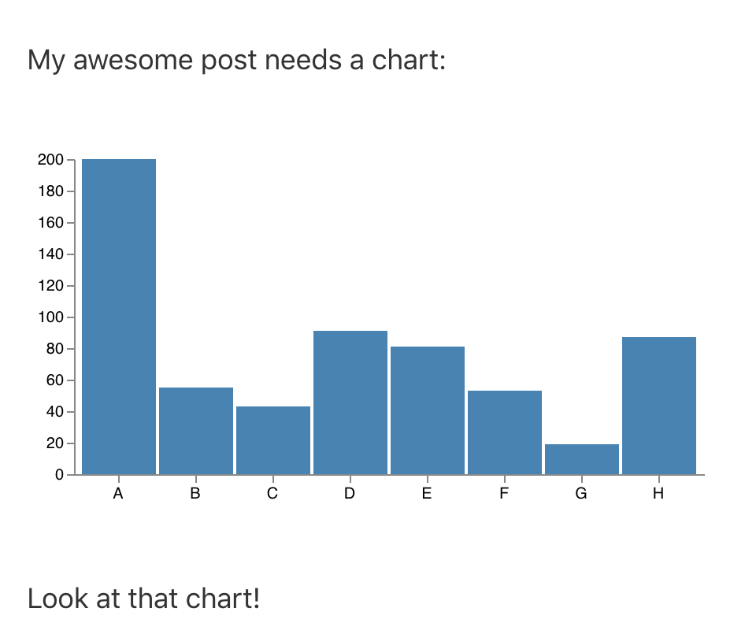

# gatsby-remark-vega

Adds the ability to include a [Vega](https://vega.github.io/vega/) visualization from a markdown file.



## Usage

In your markdown, you can include `vega` JSON files like so:

```
My awesome post needs a chart:

`vega:chart.json`

Look at that chart!
```

The json file should sit within the same folder as the markdown file.

[An example repo demonstrating the plugin is available](https://github.com/thekevinscott/gatsby-remark-vega-example).

## Installation

The plugin can be installed with `npm` or `yarn`:

`npm install gatsby-transformer-remark rehype-react gatsby-remark-vega`

`yarn add gatsby-transformer-remark rehype-react gatsby-remark-vega`

The process for installing this plugin mimics that of [`gatsby-remark-component`](https://github.com/hebilicious/gatsby-remark-component).

### 1.
Include the plugin in `gatsby-config.js`, as a plugin option for `gatsby-transformer-remark`:
```
// In your gatsby-config.js
plugins: [
  {
    resolve: `gatsby-transformer-remark`,
    options: {
      plugins: [
        `gatsby-remark-vega`,
      ],
    },
  },
];
```

### 2.
In your template, follow the same technique as showcased in `gatsby-remark-component`:

```
// within your markdown template
import rehypeReact from "rehype-react"
import Vega, { KEY as vegaKey } from "gatsby-remark-vega/Vega";

const renderAst = new rehypeReact({
  createElement: React.createElement,
  components: {
    [vegaKey]: Vega,
  }
}).Compiler
```

### 3.
Where you render your markdown, replace:

```
<div dangerouslySetInnerHTML={{ __html: post.html }} />
```

with

```
<div>{renderAst(post.htmlAst)}</div>
```

### 4.
In your graphql query, make sure to select `htmlAst`:

```
...
markdownRemark(fields: { slug: { eq: $slug } }) {
 htmlAst // previously `html`
 ...
}
```
